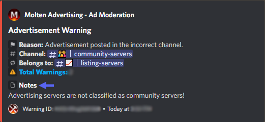

:::note Overview
In this guide, you will learn how to do your **tasks**, **moderate advertisements** efficently, and everything there is to being in the **Molten Advertising Moderation Team**.
:::

## Tasks
Your tasks as a member of the **Moderation Team** consists of (but not limited to):

  - Issue **10** <u>valid</u> advertisement warnings
    - *Checks for advertisement warnings are done every* **Saturday Morning PST**
  - Moderate #💬︱lounge
  - Handle [Modmail](./modmail-guide.md) **threads**
  - Handle [Modmail](./modmail-guide.md) **reports** (and other reports)

## Advertisement Warnings

:::caution Warning
Make sure to **read advertisements** before you issue an advertisement warning (ad warn) and **don't** issue false warnings! This can result in a strike or a removal from the Moderation Team
:::

🔑 Key

> `[foo|bar]` - Text separated in brackets means you can use either **foo** or **bar** to get the same command result

> `[arg=value]` - An argument in brackets means this is an **optional argument**, if it's not provided a default value of '**value**' will take it's place

> `<arg>` - An argument in less and greater than signs means that this is a **required argument**, it must be provided or the command will fail

### Commands

:::tip
The commands we use for advertisement warnings are mainly slash commands. **Make sure you're using the latest version of Discord**!

> When warning a member and they reach **2 ad warnings**, warn them with **Server Manager** bot the expiration being **7 days**:
> `/warn member:id custom_reason:2aw duration: 7d moderator_hidden:True`
:::

| Usage | Description |
| ----------------------- | ----------- |
| ⭐ <code>/adwarn &lt;member&gt &lt;reason&gt &lt;channel&gt [belongs_to_channel] [notes]</code> | Issue an advertisement warning |
| <code>>case &lt;warning_id&gt</code> | View an advertisement warning by ID |
| <code>>delwarn &lt;warning_id&gt</code> | Delete an advertisement warning by ID |

<DiscordComponent>
  <DiscordMessage author="Molten's Utilities" avatar="/img/moltensutilities.png">
    

      <DiscordInteraction author="vNziie--" avatar="/img/logo.png" command>
        adwarn
      </DiscordInteraction>
    

    ✅ Successfully ad warned that member!
  </DiscordMessage>
</DiscordComponent>

⭐ Command Breakdown

Command Explanation

The `/adwarn` command sends a message in the #🚨︱open-moderation channel and is stored in the database of **Molten's Utilities**. A **warning ID** is random generated ID which is _12 characters long_. This ID is unique to every advertisement warning, users can find this ID at the embed footer of the ad warning message *and* direct message they get. Users can message the modmail bot @Molten Support#3319 to appeal this warning. These warnings are stored for **7 days** then removed (expired). Users are notified of this expiration.

 

Command Arguments

*These are the arguments that aren't self explanatory*

> `belongs_to_channel` - This argument is only required and used when you use the `Incorrect Channel` preset reason. This is the channel the advertisement would belong to.

> `notes` - This argument is displayed as an embed field on the ad warning embed. This is typically not used unless you need to provide more context. **Example below**.

 

:::caution Warning
This guide is still not finished yet!
:::
